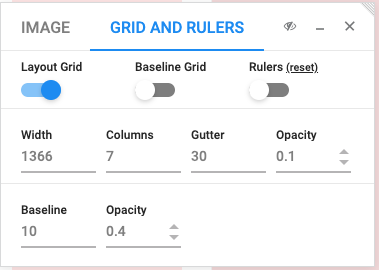

# Project Summary
---
The goal of this final project is to show you know how to use all the skills you've learned in the previous
lessons and projects.

This repository contains a single image file and some assets you'll need to complete this project.
Your objective is to create a webpage that is as near pixel-perfect, in reference to that image file,
as possible.

To assist you with creating a pixel perfect design, we suggest using the [PixelParallel](https://chrome.google.com/webstore/detail/pixelparallel-by-htmlburg/iffnoibnepbcloaaagchjonfp)
chrome extension.

We will provide you with some settings that will give you a clue to the dimensions of the webpage.

### Design Dimensions
---
To constrain the design space you will only need to create your page for the following viewport.

Viewport: **1366x768 pixels**

Some helpful settings for your PixelParallel extension are in the image below. This will give an idea
of what the margins and padding dimensions are.

You can then overlay the reference image using PixelParallel and start building.

### Instructions
---
**IMPORTANT!!!**: Using `git` create a new branch named `submission`. Your pull request **must** be made from this `submission` branch.

Due to the way this will be graded there is a specific file layout that must adhered to.

**IMPORTANT!!!:** Your submitted pull request must have an **index.html** file at the root of the repository. By default
this repository already has the **index.html** at the root, so please don't move this file.

    # please don't move the index.html file in this folder structure
    .
    ├── README.md
    ├── final_1366x768.png
    ├── images
    │   ├── pic01.jpg
    │   ├── pic02.jpg
    │   ├── pic03.jpg
    │   └── pic04.jpg
    ├── index.css
    ├── index.html
    └── readme-assets
        └── pixel_parallel.png

**IMPORTANT!!!:** Please fill out the **user.json** file at the root of your repository. This file will also be parsed as part of the grading
process.

    # example format
    {
      "name": $YOUR_NAME,
      "email": $YOUR_EMAIL
    }

### Grading
---
Your submission will be graded based on how closely it matches the reference image. The comparison
will be made by running it through an image comparison program.

### Finished
---
Open a pull request with your completed submission back to this repository. You **must** open the pull request from the `submission` branch you created. 